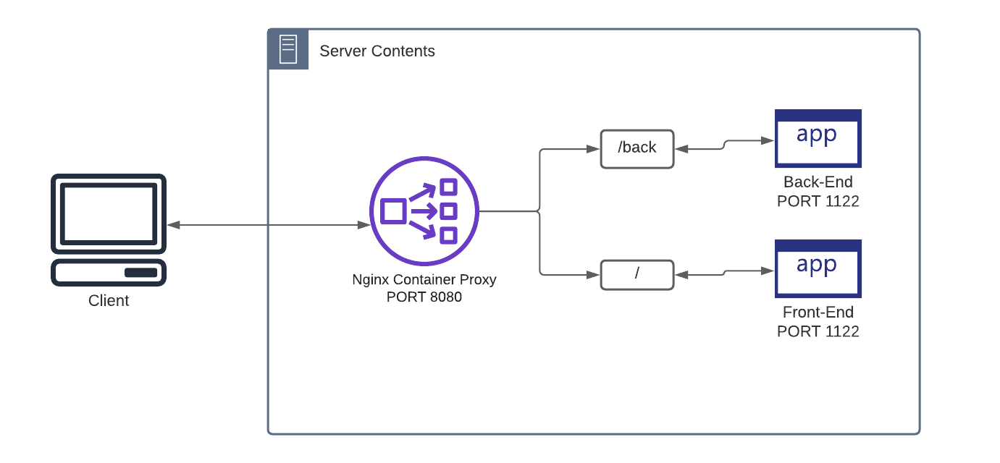

## Description
***Docker compose to perform the below tasks:***
1. Run the nginx container.
2. The container is running on port 8080.
3. Nginx conf should be mounted as a volume.
4. Run a service on any port except 8080.
5. configure the reverse proxy on nginx to access the above service via nginx.
---
## Diagram

---
### Run
  `docker-compose -d up;
`

---
### Open
* Front: http://localhost:1122
* Back: http://localhost:1122/back
